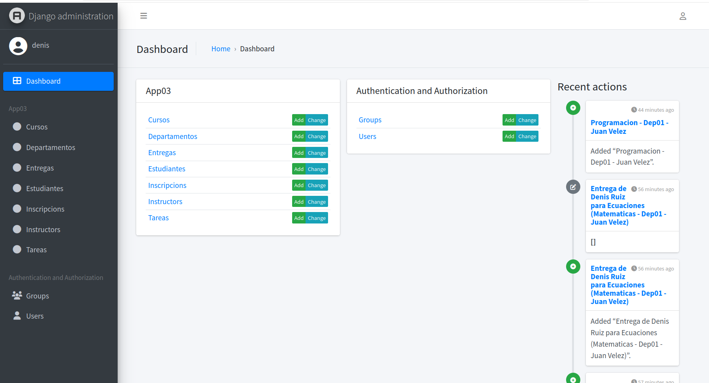
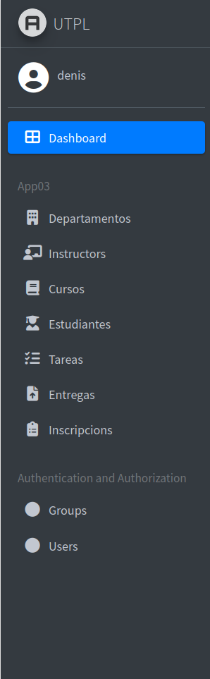
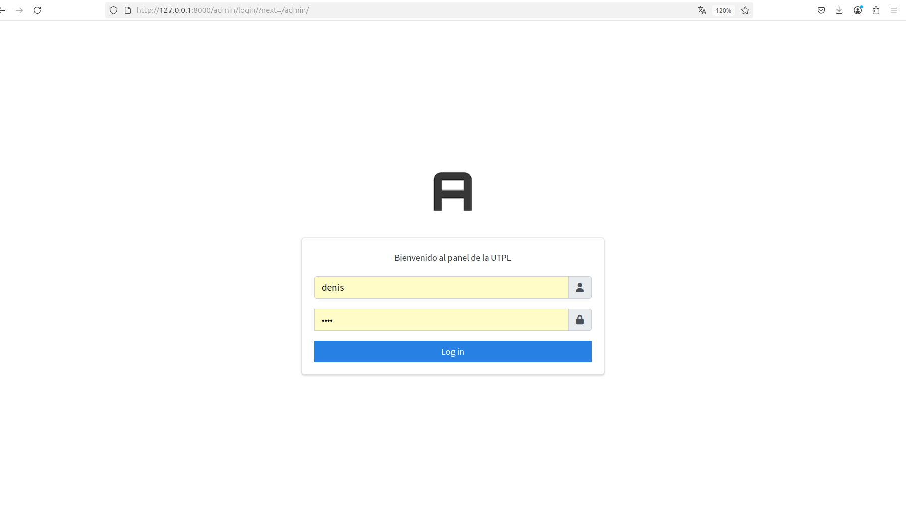
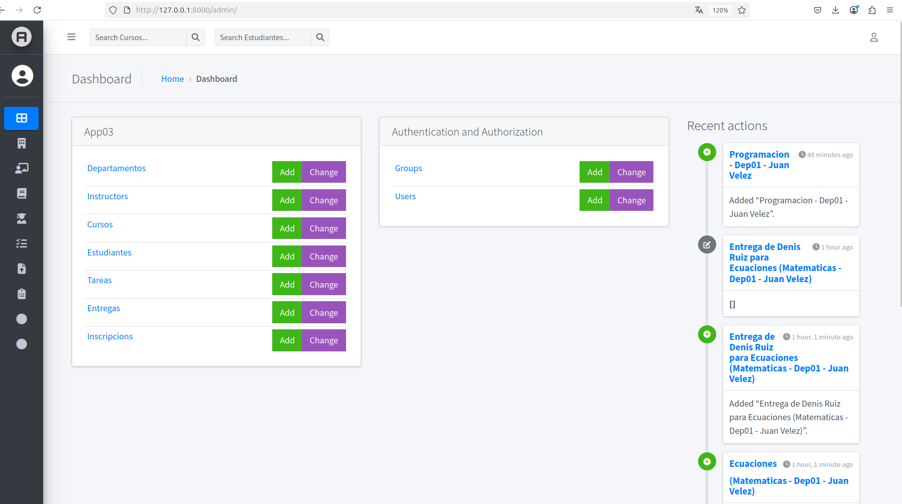
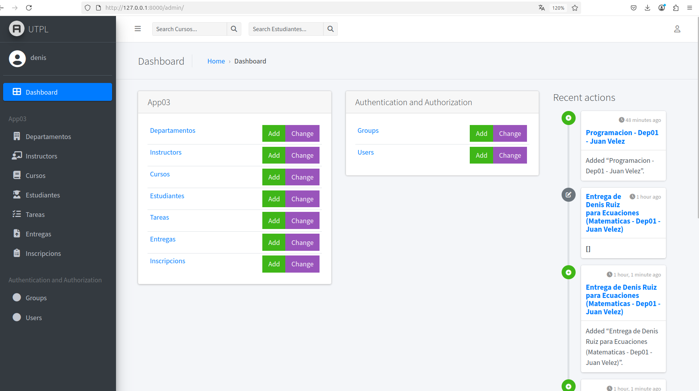

# Cambio

## Al inicio

## Cambios realizados con Jazzmin
### Título del sitio: se cambió de “Django administration” a “Panel Académico”.

### Cambio en el Inicio de Seccion agregando temas de la documentacion 

### Agregue Iconos para que se vea mejor al colapzar el siderbar

### Tema visual: se aplicó el tema Cosmo para un diseño más moderno y limpio
### Modo oscuro alternativo: se activó el tema Cyborg como opción de visualización oscura.
